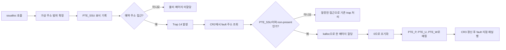

# SSU xv6 Memory Allocation & Multi-level File System

> 구현 과정의 문제–원인–해결–검증 기록은 [TROUBLESHOOTING.md](./TROUBLESHOOTING.md)에서 확인할 수 있습니다.

> xv6의 가상 메모리를 지연 할당 방식으로 확장하고, 기존 파일시스템을 최대 약
> 1GiB 파일을 지원하는 다단계 인덱스 구조로 재설계한 운영체제 프로젝트입니다.

이 저장소는 MIT의 x86용 [`xv6-public`](https://github.com/mit-pdos/xv6-public)을
기반으로 합니다. 프로젝트의 목적은 단순히 시스템 콜을 추가하는 데 그치지 않고,
가상 주소와 물리 페이지의 관계, page fault 처리, 페이지 테이블, inode, block
mapping, 파일 삭제 시 자원 회수 과정을 xv6 커널 내부에서 직접 구현하는 것입니다.

## 목차

- [프로젝트 개요](#프로젝트-개요)
- [핵심 기능](#핵심-기능)
- [과제 요구사항과 구현 현황](#과제-요구사항과-구현-현황)
- [가상 메모리 설계](#가상-메모리-설계)
- [Multi-level 파일시스템 설계](#multi-level-파일시스템-설계)
- [프로젝트 구조](#프로젝트-구조)
- [빌드 및 실행](#빌드-및-실행)
- [테스트](#테스트)
- [검증 결과](#검증-결과)
- [제공 테스트 연동](#제공-테스트-연동)

## 프로젝트 개요

기본 xv6는 프로세스의 주소 공간을 확장할 때 가상 메모리와 물리 메모리를 함께
할당하며, 파일 하나를 12개의 direct block과 1개의 indirect block으로 관리합니다.
이 프로젝트에서는 두 구조를 다음과 같이 확장했습니다.

1. `ssualloc()`은 가상 주소 공간만 먼저 예약합니다. 예약된 주소를 실제로 접근할
   때 발생하는 x86 page fault를 처리해 접근한 페이지 하나에만 물리 메모리를
   할당합니다.
2. inode의 13개 주소 필드를 6 direct, 4 single-indirect, 2 double-indirect,
   1 triple-indirect 구조로 해석하여 파일 하나가 최대 2,130,438개의 데이터
   블록을 사용할 수 있게 합니다.

### 개발 기준

| 항목 | 내용 |
|---|---|
| 기반 운영체제 | MIT xv6-public, x86 버전 |
| 기준 커밋 | `eeb7b41` |
| 구현 언어 | C, x86 Assembly |
| 페이지 크기 | 4,096 bytes |
| 파일시스템 블록 크기 | 512 bytes |
| 파일시스템 이미지 크기 | 2,500,000 blocks, 약 1.2GiB |
| 최대 파일 데이터 블록 | 2,130,438 blocks |
| 최대 파일 크기 | 1,090,784,256 bytes, 약 1.02GiB |

> 과제 명세에 표기된 `params.h`는 xv6-public 원본의 `param.h`에 해당합니다.

## 핵심 기능

- `ssualloc(size)`를 통한 page 단위 가상 메모리 예약
- 잘못된 크기와 주소 공간 overflow 검사
- x86 Page Fault, Trap 14 처리
- 접근한 가상 페이지만 물리 페이지로 materialize
- `getvp()`를 통한 프로세스 가상 페이지 수 조회
- `getpp()`를 통한 실제 present 물리 페이지 수 조회
- lazy page를 유지한 `fork()` 주소 공간 복제
- 시스템 콜의 사용자 버퍼와 `copyout()`에서 lazy page 지원
- 6 direct + 4 single + 2 double + 1 triple block mapping
- 인덱스 블록의 필요 시점 할당과 journal 기록
- 파일 삭제 시 데이터 블록과 모든 단계의 인덱스 블록 회수
- 2,500,000블록 파일시스템 이미지 생성
- 메모리와 파일시스템을 독립적으로 검증하는 테스트 프로그램 제공

## 과제 요구사항과 구현 현황

### 1. 가상 메모리 할당 시스템 콜

| 명세 요구사항 | 구현 내용 | 상태 |
|---|---|:---:|
| `ssualloc()`은 할당 크기 하나를 인자로 받음 | `int` 크기 인자를 받는 시스템 콜 22번으로 등록 | ✅ |
| 인자는 양수여야 함 | `n <= 0`이면 `-1` 반환 | ✅ |
| 인자는 페이지 크기의 배수여야 함 | `n % PGSIZE != 0`이면 `-1` 반환 | ✅ |
| 유효하지 않은 입력은 `-1` 반환 | 크기, 정렬, overflow, `KERNBASE` 경계를 검사 | ✅ |
| 성공하면 할당한 가상 메모리 주소 반환 | 페이지 정렬된 예약 영역의 시작 주소 반환 | ✅ |
| 호출 시 가상 메모리만 할당 | PTE에 예약 표식만 남기고 데이터 물리 페이지는 할당하지 않음 | ✅ |
| 접근 시 물리 페이지를 페이지 단위로 할당 | page fault 주소를 내림 정렬한 뒤 해당 페이지 하나만 `kalloc()` | ✅ |
| 여러 페이지 중 접근한 페이지만 할당 | 각 PTE를 독립적으로 예약하고 fault가 발생한 PTE만 present로 변경 | ✅ |
| trap 종류와 처리 방법 설명 | [Page fault 처리 흐름](#page-fault-trap-처리)에 기술 | ✅ |
| 제공 `ssualloc_test`를 Makefile에 포함 | 동일 이름의 테스트 실행 파일을 `UPROGS`에 등록했으며 원본 제공 파일 수신 후 교체 가능 | 🟡 |

### 2. 메모리 정보 조회 시스템 콜

| 명세 요구사항 | 구현 내용 | 상태 |
|---|---|:---:|
| `getvp()`는 인자를 받지 않음 | 인자 없는 시스템 콜 23번으로 등록 | ✅ |
| 호출 프로세스의 가상 페이지 수 반환 | `PGROUNDUP(proc->sz) / PGSIZE` 반환 | ✅ |
| `getpp()`는 인자를 받지 않음 | 인자 없는 시스템 콜 24번으로 등록 | ✅ |
| 호출 프로세스의 물리 페이지 수 반환 | 주소 공간의 PTE를 순회해 `PTE_P`가 설정된 페이지를 집계 | ✅ |
| 예약만 한 페이지는 물리 페이지에서 제외 | `PTE_SSU`만 있고 `PTE_P`가 없는 페이지는 집계하지 않음 | ✅ |

### 3. Multi-level 파일시스템

| 명세 요구사항 | 구현 내용 | 상태 |
|---|---|:---:|
| direct block 6개 | `addrs[0]`부터 `addrs[5]` 사용 | ✅ |
| indirect block 4개 | `addrs[6]`부터 `addrs[9]` 사용 | ✅ |
| 2-level indirect block 2개 | `addrs[10]`, `addrs[11]` 사용 | ✅ |
| 3-level indirect block 1개 | `addrs[12]` 사용 | ✅ |
| 최대 2,130,438개 데이터 블록 지원 | `MAXFILE`을 명세의 계층별 합으로 계산 | ✅ |
| `FSSIZE`를 1,000에서 2,500,000으로 변경 | `param.h`의 `FSSIZE` 변경 | ✅ |
| 제공 `ssufs_test`를 수정하지 않고 실행 | 동일 이름의 실행 파일을 Makefile에 등록했으며 원본 제공 파일 수신 후 최종 확인 필요 | 🟡 |
| 5, 500, 5,000, 50,000블록 파일 지원 | 각 크기를 생성·재읽기·삭제하는 자체 테스트 포함 | ✅ |
| 파일 삭제 시 할당한 블록 해제 | 데이터와 1·2·3단계 인덱스 블록을 재귀적으로 해제 | ✅ |
| xv6-public 원본 기준 변경 파일 제출 | 원본 inode 크기를 유지하고 변경 소스와 Makefile을 포함 | ✅ |

### 4. 제출 관련 요구사항

원 명세는 다음을 제출하도록 요구합니다.

- `ssualloc_test`와 `ssufs_test` 실행 결과가 포함된 보고서
- page fault의 종류와 처리 과정 설명
- xv6-public 원본을 기준으로 변경한 모든 소스코드
- 테스트 프로그램이 포함된 `Makefile`
- 이전 과제의 변경 사항이 섞이지 않은 독립적인 과제 4 소스

이 저장소에는 구현 소스, Makefile, 대체 테스트 프로그램 및 trap 처리 설명이
포함되어 있습니다. 별도의 수업 제출 보고서와 실행 화면 캡처는 제출 형식에 맞춰
추가해야 합니다.

## 가상 메모리 설계

### 시스템 콜 인터페이스

```c
void *ssualloc(int size);
int getvp(void);
int getpp(void);
```

`ssualloc()`은 예약 영역의 시작 주소를 반환합니다. 요청 크기는 반드시 4,096의
양수 배수여야 합니다. 프로세스의 현재 크기가 페이지 경계에 있지 않으면 다음
페이지 경계부터 영역을 예약합니다.

### 예약 PTE

페이지를 예약했다는 사실을 기록하기 위해 x86 PTE의 운영체제 사용 가능 비트 중
하나를 `PTE_SSU`로 정의했습니다.

```c
#define PTE_SSU 0x200
```

예약 직후의 PTE에는 `PTE_SSU`, `PTE_U`, `PTE_W`가 기록되지만 `PTE_P`는
설정되지 않습니다. 따라서 CPU 입장에서는 아직 존재하지 않는 페이지이며,
사용자가 해당 주소를 처음 읽거나 쓰면 page fault가 발생합니다.

### Page fault trap 처리

이 프로젝트가 처리하는 trap은 x86의 **Page Fault Exception, Trap Number 14**입니다.
CPU의 `CR2` 레지스터에는 fault를 발생시킨 가상 주소가 저장됩니다.



처리 과정은 다음과 같습니다.

1. `rcr2()`로 fault 가상 주소를 읽습니다.
2. `PGROUNDDOWN()`으로 해당 주소를 페이지 시작 주소에 맞춥니다.
3. page fault error code의 present 비트가 0인지 확인합니다.
4. 해당 PTE가 `ssualloc()`으로 예약된 `PTE_SSU` 페이지인지 확인합니다.
5. 유효한 예약 페이지에만 `kalloc()`으로 물리 페이지 하나를 할당합니다.
6. 페이지 전체를 0으로 초기화합니다.
7. PTE를 `PTE_P | PTE_W | PTE_U` 권한으로 갱신합니다.
8. CR3를 다시 로드하여 TLB를 갱신하고 fault가 발생한 명령으로 돌아갑니다.

`PTE_SSU`가 없는 주소, 이미 present인 페이지의 protection fault 또는 커널 주소
공간 접근은 lazy allocation 대상으로 인정하지 않고 xv6의 기존 오류 처리 경로로
전달합니다.

### 기존 xv6 기능과의 호환성

Lazy allocation을 추가하면 `proc->sz` 아래의 모든 페이지가 present라는 기존
xv6의 가정이 깨집니다. 이를 보완하기 위해 다음 부분도 함께 수정했습니다.

- `copyuvm()`: 아직 물리화되지 않은 `PTE_SSU` 페이지를 panic 없이 자식의
  페이지 테이블에 예약 상태로 복제합니다.
- `deallocuvm()`: 축소되는 주소 범위의 present 페이지뿐 아니라 예약 PTE도
  제거합니다.
- `uva2ka()`: page table 또는 PTE가 없는 경우 null pointer를 역참조하지 않습니다.
- `copyout()`: 목적지가 예약 페이지라면 먼저 해당 페이지를 물리화한 뒤 복사합니다.
- Kernel-mode fault: 시스템 콜이 예약된 사용자 버퍼를 읽거나 쓰다가 발생한
  fault도 `PTE_SSU` 검증 후 안전하게 처리합니다.

## Multi-level 파일시스템 설계

### inode 주소 구조

기존 xv6의 `struct dinode`와 `struct inode`는 주소 필드 13개를 유지하되 각 필드의
역할을 다음과 같이 변경했습니다. 따라서 on-disk inode의 전체 크기는 바뀌지
않습니다.

```text
addrs[0..5]   ──> Data block                         (6 direct)
addrs[6..9]   ──> Index ──> Data                     (4 single)
addrs[10..11] ──> Index ──> Index ──> Data           (2 double)
addrs[12]     ──> Index ──> Index ──> Index ──> Data (1 triple)
```

각 인덱스 블록에는 4바이트 블록 번호가 128개 들어갑니다.

| 영역 | 계산 | 데이터 블록 수 | 논리 블록 번호 |
|---|---:|---:|---:|
| Direct | `6` | 6 | 0–5 |
| Single indirect | `4 × 128` | 512 | 6–517 |
| Double indirect | `2 × 128 × 128` | 32,768 | 518–33,285 |
| Triple indirect | `128 × 128 × 128` | 2,097,152 | 33,286–2,130,437 |
| 합계 | `6 + 512 + 32,768 + 2,097,152` | **2,130,438** | 0–2,130,437 |

### 블록 매핑

`bmap()`은 파일의 논리 블록 번호를 받아 해당 계층과 각 단계의 인덱스를
계산합니다. 필요한 데이터 또는 인덱스 블록이 없으면 `balloc()`으로 즉시
할당하고, 인덱스 블록을 변경한 경우 `log_write()`로 xv6 journal에 기록합니다.

예를 들어 논리 블록 33,286은 triple-indirect 영역의 첫 번째 데이터 블록입니다.
해당 블록에 처음 쓰면 `addrs[12]`의 root index, 두 개의 하위 index block,
데이터 블록이 순서대로 생성됩니다.

### 파일 삭제와 블록 회수

기존 `itrunc()`는 direct block과 단일 indirect block 하나만 해제할 수 있습니다.
수정된 구현은 `bfreeindirect(dev, block, level)`을 통해 다음 순서로 전체 트리를
재귀적으로 제거합니다.

1. 가장 아래의 데이터 블록을 모두 `bfree()`합니다.
2. 자식 항목을 모두 처리한 인덱스 블록을 `bfree()`합니다.
3. inode의 해당 `addrs[]` 값을 0으로 초기화합니다.
4. 파일 크기를 0으로 만들고 inode를 디스크에 반영합니다.

이 방식으로 파일을 삭제한 뒤 데이터 블록뿐 아니라 중간 인덱스 블록까지 다시
사용할 수 있습니다.

### 대용량 파일시스템 이미지

명세에 따라 `FSSIZE`를 2,500,000블록으로 확장했습니다. 일반적인 방식으로
모든 블록에 0을 쓰면 이미지 생성 시간이 매우 길어지므로, host의 `mkfs`는
`ftruncate()`를 사용해 sparse file을 만든 다음 실제 메타데이터와 초기 파일이
필요한 블록만 기록합니다. 논리적인 이미지 크기와 xv6에서 보이는 디스크 구조는
동일합니다.

Host에서 초기 파일을 이미지에 넣는 `mkfs.c::iappend()`도 새 multi-level 구조를
사용하도록 변경했습니다. 따라서 6개 direct block을 넘는 사용자 프로그램도
정상적으로 파일시스템 이미지에 포함됩니다.

## 프로젝트 구조

다음은 xv6 원본에서 변경하거나 추가한 주요 파일입니다.

| 파일 | 역할 |
|---|---|
| `mmu.h` | lazy page 식별용 `PTE_SSU` 비트 정의 |
| `vm.c` | 가상 페이지 예약, fault 페이지 물리화, 물리 페이지 집계, fork 호환 처리 |
| `trap.c` | x86 Page Fault Trap 14 처리 |
| `sysproc.c` | `ssualloc`, `getvp`, `getpp` 커널 시스템 콜 구현 |
| `syscall.h` | 신규 시스템 콜 번호 22–24 정의 |
| `syscall.c` | 신규 시스템 콜 dispatch table 등록 |
| `user.h` | 사용자 프로그램용 시스템 콜 선언 |
| `usys.S` | 신규 시스템 콜 assembly stub 생성 |
| `defs.h` | 커널 메모리 보조 함수 선언 |
| `fs.h` | multi-level 상수, `MAXFILE`, on-disk inode 주소 배열 정의 |
| `file.h` | in-memory inode 주소 배열 크기 반영 |
| `fs.c` | multi-level `bmap()`과 재귀적 `itrunc()` 구현 |
| `param.h` | `FSSIZE`를 2,500,000으로 확장 |
| `mkfs.c` | multi-level 초기 파일 매핑과 sparse 이미지 생성 |
| `Makefile` | `ssualloc_test`, `ssufs_test` 사용자 프로그램 포함 |
| `ssualloc_test.c` | 메모리 예약 및 페이지별 물리 할당 검증 |
| `ssufs_test.c` | 4단계 파일 크기의 쓰기·읽기·삭제 검증 |

## 빌드 및 실행

### 요구 환경

- Linux 또는 x86 ELF cross compiler를 사용할 수 있는 환경
- GCC와 GNU Binutils의 32비트 x86 지원
- GNU Make
- QEMU의 `qemu-system-i386` 또는 `qemu-system-x86_64`
- 파일시스템 이미지를 위한 약 1.2GiB의 논리적 디스크 공간

Ubuntu 계열에서는 다음 패키지로 빌드 환경을 준비할 수 있습니다.

```bash
sudo apt update
sudo apt install build-essential gcc-multilib qemu-system-x86
```

### 빌드

```bash
make clean
make
make fs.img
```

`make`는 xv6 kernel image를, `make fs.img`는 테스트 프로그램이 포함된
파일시스템 이미지를 생성합니다.

### QEMU 실행

```bash
make qemu-nox
```

GUI 환경을 사용하려면 다음 명령을 사용할 수 있습니다.

```bash
make qemu
```

## 테스트

### 1. 가상 메모리 테스트

xv6 셸에서 실행합니다.

```sh
ssualloc_test
```

테스트 항목은 다음과 같습니다.

- 크기 0 요청 거부
- 페이지 크기의 배수가 아닌 요청 거부
- 한 페이지 예약 후 가상 페이지만 증가하는지 확인
- 예약 페이지 접근 후 물리 페이지만 하나 증가하는지 확인
- 세 페이지 예약 후 접근 순서대로 물리 페이지가 각각 증가하는지 확인

정상 출력의 핵심 흐름은 다음과 같습니다.

```text
Start: memory usages: virtual pages: 3, physical pages: 3
ssualloc() usage: argument wrong...
ssualloc() usage: argument wrong...
After allocate one virtual page: virtual pages: 4, physical pages: 3
After access one virtual page: virtual pages: 4, physical pages: 4
After allocate three virtual pages: virtual pages: 7, physical pages: 4
After access of first virtual page: virtual pages: 7, physical pages: 5
After access of third virtual page: virtual pages: 7, physical pages: 6
After access of second virtual page: virtual pages: 7, physical pages: 7
ssualloc_test passed
```

### 2. 파일시스템 테스트

```sh
ssufs_test
```

| 테스트 | 파일 크기 | 주로 검증하는 영역 |
|---|---:|---|
| Test 1 | 5 blocks | Direct |
| Test 2 | 500 blocks | Single indirect |
| Test 3 | 5,000 blocks | Double indirect |
| Test 4 | 50,000 blocks | Triple indirect |

각 테스트는 다음 순서로 수행됩니다.

1. 새 파일 생성
2. 지정된 수의 512바이트 블록 기록
3. 파일 descriptor 종료
4. 파일을 다시 열어 전체 데이터와 패턴 비교
5. 파일 삭제
6. 삭제한 파일을 다시 열 수 없는지 확인

## 검증 결과

| 검증 항목 | 결과 |
|---|:---:|
| 변경 C 파일의 x86 target 문법 및 warning 검사 | 통과 |
| xv6 kernel 전체 빌드 | 통과 |
| 사용자 프로그램 및 파일시스템 이미지 빌드 | 통과 |
| QEMU에서 xv6 부팅 | 통과 |
| `ssualloc_test` 전체 시나리오 | 통과 |
| 5블록 파일 쓰기·읽기·삭제 | 통과 |
| 500블록 파일 쓰기·읽기·삭제 | 통과 |
| 5,000블록 파일 쓰기·읽기·삭제 | 통과 |
| 50,000블록 전체 실행 | 제한 시간 내 미완료 |

50,000블록 테스트는 현재 ARM host에서 x86 xv6를 소프트웨어 에뮬레이션하는
환경의 I/O 속도 때문에 제한 시간 내에 완료되지 않았습니다. Triple-indirect
구간의 범위 계산, allocation path, recursive free path는 빌드와 코드 검사를
완료했으며, 최종 제출 전 수업용 x86 환경에서 교수 제공 테스트로 한 번 더
실행하는 것을 권장합니다.

## 제공 테스트 연동

과제 명세에서는 교수자가 제공하는 `ssualloc_test`와 `ssufs_test`를 수정하지
않고 사용하도록 요구합니다. 현재 첨부 자료에는 두 테스트의 원본 소스가 없어
명세에 나온 실행 순서와 기대 결과를 재현한 자체 테스트를 포함했습니다.

교수 제공 파일을 받은 경우 다음 두 파일만 원본으로 교체하면 됩니다.

```text
ssualloc_test.c
ssufs_test.c
```

시스템 콜 이름과 Makefile의 실행 파일 이름은 이미 명세에 맞춰져 있으므로 다른
커널 코드를 수정할 필요는 없습니다.

## 라이선스 및 출처

기반 소스의 저작권과 라이선스는 저장소의 `LICENSE` 및 MIT xv6-public 프로젝트를
따릅니다. 이 구현은 xv6의 메모리 관리와 파일시스템 구조를 학습하기 위한 교육용
확장 프로젝트입니다.
